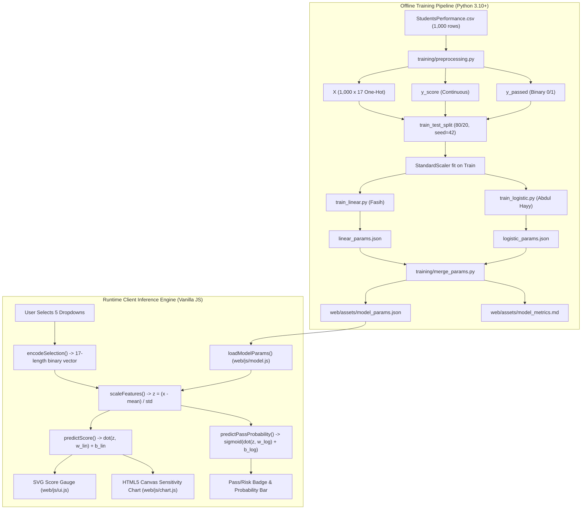

# GradeCompass - Technical Requirements Document (TRD)

**Document Version:** 2.1  
**Lead Architects:** Fasih (Core Pipeline & Deployment) & Abdul Hayy (Inference & Frontend)  
**Status:** Implemented & Verified  

---

## 1. System Architecture Overview

GradeCompass implements a decoupled two-phase architecture:
1. **Offline Training & Serialization Phase (Python)**: Dataset preprocessing, feature engineering, model training, metrics generation, and parameter compilation into a single JSON schema.
2. **Runtime Inference & Visualization Phase (Static Web Client)**: Zero-dependency client-side vector normalization, linear regression dot product, logistic regression sigmoid evaluation, and dynamic Canvas rendering.



---

## 2. Mathematical Formulations

### 2.1 Target Definitions
Given a student's individual scores in Math ($S_m$), Reading ($S_r$), and Writing ($S_w$):
$$\text{average\_score} = \frac{S_m + S_r + S_w}{3} \quad \in [0, 100]$$

With a contractual pass mark $\tau = 60$:
$$\text{passed} = \begin{cases} 1 & \text{if } \text{average\_score} \ge 60 \\ 0 & \text{if } \text{average\_score} < 60 \end{cases}$$

---

### 2.2 Feature Vector Encoding (17 Dimensions)
Each student profile is parameterized by 5 categorical features, mapped deterministically to a sparse binary vector $\mathbf{x} \in \{0, 1\}^{17}$:

$$\mathbf{x} = [x_1, x_2, \dots, x_{17}]^T \quad \text{where } \sum_{i=1}^{17} x_i = 5$$

The indices strictly adhere to `FEATURE_ORDER`:
- $x_1$: `gender_female`
- $x_2$: `gender_male`
- $x_3$: `race_group_A`
- $x_4$: `race_group_B`
- $x_5$: `race_group_C`
- $x_6$: `race_group_D`
- $x_7$: `race_group_E`
- $x_8$: `parent_edu_some_high_school`
- $x_9$: `parent_edu_high_school`
- $x_{10}$: `parent_edu_some_college`
- $x_{11}$: `parent_edu_associates_degree`
- $x_{12}$: `parent_edu_bachelors_degree`
- $x_{13}$: `parent_edu_masters_degree`
- $x_{14}$: `lunch_standard`
- $x_{15}$: `lunch_free_reduced`
- $x_{16}$: `test_prep_none`
- $x_{17}$: `test_prep_completed`

---

### 2.3 Feature Standardization
Standardization parameters $\boldsymbol{\mu} \in \mathbb{R}^{17}$ and $\boldsymbol{\sigma} \in \mathbb{R}^{17}$ are computed exclusively on the 800 training observations:
$$\mu_i = \frac{1}{N_{train}} \sum_{j=1}^{N_{train}} x_{j, i}, \quad \sigma_i = \sqrt{\frac{1}{N_{train}} \sum_{j=1}^{N_{train}} (x_{j, i} - \mu_i)^2}$$

At runtime, input vector $\mathbf{x}$ is scaled to $\mathbf{z}$:
$$z_i = \frac{x_i - \mu_i}{\sigma_i} \quad \text{for } i = 1, \dots, 17$$

---

### 2.4 Linear Regression Inference (Continuous Score)
Given weight vector $\mathbf{w}_{lin} \in \mathbb{R}^{17}$ and scalar bias $b_{lin} \in \mathbb{R}$:
$$\hat{y}_{raw} = \mathbf{w}_{lin}^T \mathbf{z} + b_{lin} = \sum_{i=1}^{17} w_{lin, i} z_i + b_{lin}$$
$$\hat{y} = \text{clamp}(\hat{y}_{raw}, 0, 100) = \min(100, \max(0, \hat{y}_{raw}))$$

- **Bias ($b_{lin}$)**: $68.1692$
- **Performance**: $R^2 = 0.1622$, $\text{MAE} = 10.49$ points, $\text{RMSE} = 13.40$ points.

---

### 2.5 Logistic Regression Inference (Pass Probability)
Given weight vector $\mathbf{w}_{log} \in \mathbb{R}^{17}$ and scalar bias $b_{log} \in \mathbb{R}$:
$$t = \mathbf{w}_{log}^T \mathbf{z} + b_{log} = \sum_{i=1}^{17} w_{log, i} z_i + b_{log}$$
$$P(\text{passed} = 1 \mid \mathbf{x}) = \sigma(t) = \frac{1}{1 + e^{-t}}$$

Decision Boundary:
$$\text{Class} = \begin{cases} \text{"Likely to Pass"} & \text{if } P(\text{passed} = 1 \mid \mathbf{x}) \ge 0.50 \\ \text{"At Risk"} & \text{if } P(\text{passed} = 1 \mid \mathbf{x}) < 0.50 \end{cases}$$

- **Bias ($b_{log}$)**: $1.1607$
- **Performance**: Accuracy $= 68.00\%$, Precision $= 72.29\%$, Recall $= 86.96\%$.

---

## 3. Data Contract Specification (`model_params.json`)

The runtime payload complies with the following strict JSON schema:

```json
{
  "feature_order": [
    "gender_female", "gender_male",
    "race_group_A", "race_group_B", "race_group_C", "race_group_D", "race_group_E",
    "parent_edu_some_high_school", "parent_edu_high_school", "parent_edu_some_college",
    "parent_edu_associates_degree", "parent_edu_bachelors_degree", "parent_edu_masters_degree",
    "lunch_standard", "lunch_free_reduced",
    "test_prep_none", "test_prep_completed"
  ],
  "categorical_options": {
    "gender": ["female", "male"],
    "race_ethnicity": ["group A", "group B", "group C", "group D", "group E"],
    "parental_education": [
      "some high school", "high school", "some college",
      "associate's degree", "bachelor's degree", "master's degree"
    ],
    "lunch": ["standard", "free/reduced"],
    "test_preparation_course": ["none", "completed"]
  },
  "scaler": {
    "mean": [ /* 17 floats */ ],
    "std": [ /* 17 floats */ ]
  },
  "linear_regression": {
    "weights": [ /* 17 floats */ ],
    "bias": 68.16916666666665,
    "pass_threshold": 60
  },
  "logistic_regression": {
    "weights": [ /* 17 floats */ ],
    "bias": 1.1607353908814024
  },
  "metadata": {
    "trained_on_rows": 1000,
    "linear_r2": 0.16217185763155217,
    "linear_mae": 10.490182374209294,
    "logistic_accuracy": 0.68,
    "logistic_precision": 0.7228915662650602,
    "logistic_recall": 0.8695652173913043,
    "dataset_source": "Kaggle - Students Performance in Exams"
  }
}
```

---

## 4. Client-Side Implementation Details

### 4.1 Feature Mapping Normalization (`web/js/model.js`)
User string selections from `<select>` controls are normalized to one-hot column names using regex string sanitizer rules:
```javascript
function getFeatureName(categoryKey, value) {
  if (categoryKey === "gender") return `gender_${value}`;
  if (categoryKey === "race_ethnicity") return `race_${value.replace(" ", "_")}`;
  if (categoryKey === "parental_education") {
    const clean = value.replace(/'/g, "").replace(/\s+/g, "_");
    return `parent_edu_${clean}`;
  }
  if (categoryKey === "lunch") return `lunch_${value.replace("/", "_")}`;
  if (categoryKey === "test_preparation_course") return `test_prep_${value}`;
  return `${categoryKey}_${value}`;
}
```

### 4.2 Canvas Sensitivity Bar Chart (`web/js/chart.js`)
- Uses `<canvas>` with device pixel ratio scaling:
  ```javascript
  const dpr = window.devicePixelRatio || 1;
  canvas.width = rect.width * dpr;
  canvas.height = rect.height * dpr;
  ctx.scale(dpr, dpr);
  ```
- Draws horizontal reference line at $y = \tau = 60$ with dashed strokes (`ctx.setLineDash([4, 4])`).
- Highlights score delta ($\Delta = \hat{y}_{completed} - \hat{y}_{none}$) dynamically.

---

## 5. Verification & Test Architecture

1. **Python Unit & Parity Harness** ([`tests/test_inference.py`](file:///c:/Users/LENOVO/OneDrive/Desktop/GradeCompass/tests/test_inference.py)):
   - Generates 4 synthetic student test profiles.
   - Evaluates reference predictions with scikit-learn's `model.predict()` and `model.predict_proba()`.
   - Simulates browser vector scaling and dot-product calculations in NumPy.
   - Asserts absolute parity within tolerance $\epsilon < 10^{-4}$.
2. **Node.js Inference Engine Suite** ([`tests/test_inference.js`](file:///c:/Users/LENOVO/OneDrive/Desktop/GradeCompass/tests/test_inference.js)):
   - Loads exported `model_params.json`.
   - Tests `encodeSelection` ensuring exactly 5 active indices per vector.
   - Asserts bounded scores ($0 \le \hat{y} \le 100$) and valid probabilities ($0 \le P \le 1$).

---

## 6. Vercel Static Deployment Architecture

- **Configuration File**: [`vercel.json`](file:///c:/Users/LENOVO/OneDrive/Desktop/GradeCompass/vercel.json)
  ```json
  {
    "outputDirectory": "web"
  }
  ```
- **Execution Lifecycle**:
  - Vercel clone repo &rarr; detect static framework &rarr; route HTTP traffic to `./web`.
  - Zero build steps; asset distribution cached globally across Vercel Edge CDN nodes.
